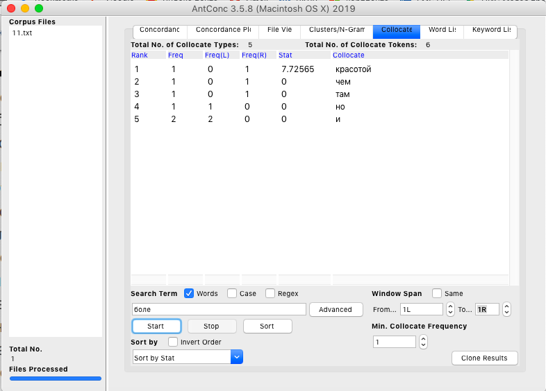
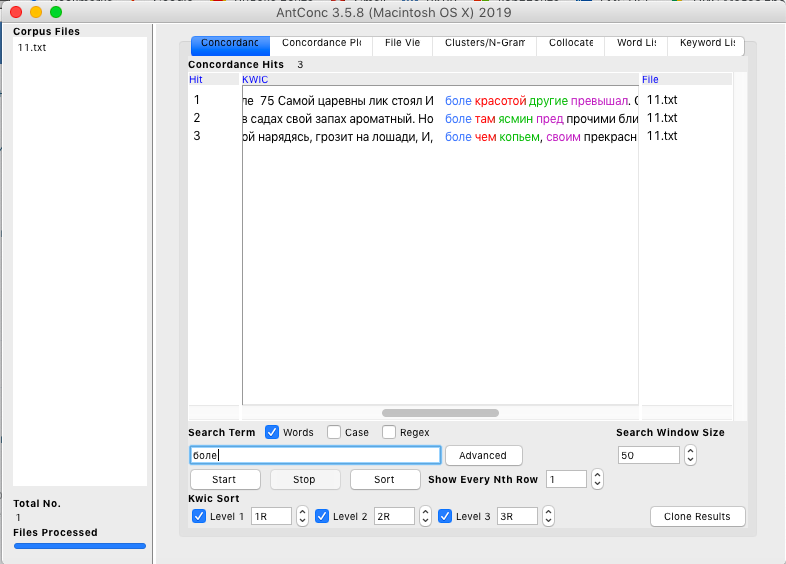
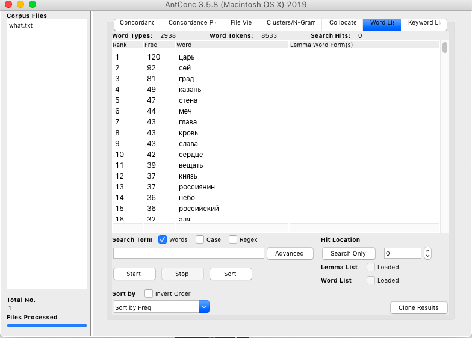
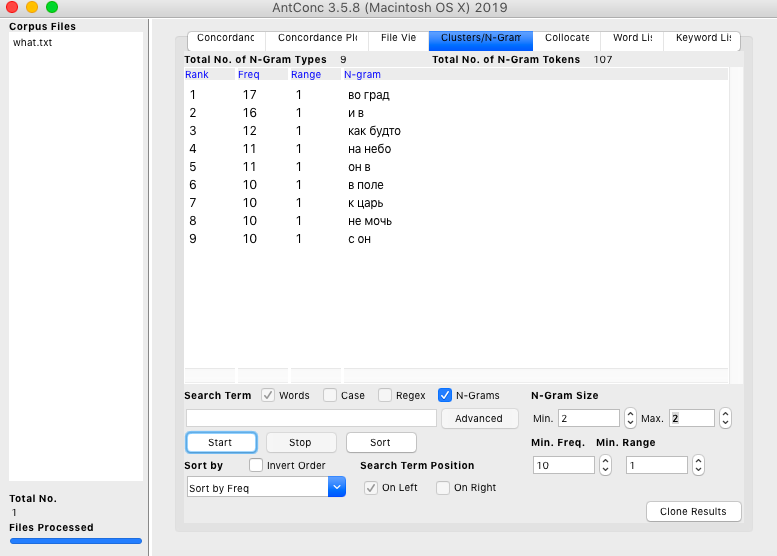

# HW3
Часть 1
задание 6

задание 4

задание 3

задание 5

Часть 2

Рассматривая употребление местоимения «сей» и его современного аналога «этот», можно сделать вывод о том, что «сей», ожидаемо, употреблялось более часто в первой половине XIX века, однако можно также заметить, что эта форма не совсем вышла из употребления даже в XXI веке  — это так из-за широкого употребления в современном языке устоявшихся словосочетаний вроде «по сей день», «до сих пор» и т.д. Что касается современного синонима, местоимения «этот», заметно, что графики Google Ngrams и НКРЯ несколько расходятся в определении частотности его употребления. Согласно Google Ngrams, в XIX веке эта форма почти не употреблялась, «взлет» употребления произошел только в 20-е года XX века. Однако судя по графику НКРЯ, этот «взлет» произошел раньше, и до него данная форма употреблялась активнее, чем показывает Google Ngrams. Можно заключить, что графики НКРЯ и Google Ngrams частично расходятся, но эти расхождения не критичны.

Анализируя пару «очи — глаза», стоит отметить, что графики НКРЯ и Google Ngrams практически совпадают: на обоих графиках, рассматривающих современный синоним «глаза», заметно, что в начале XIX века имел место быть некоторый упадок употребления этой формы по сравнению с последующими годами, в течение которых частота употребления была хотя и нестабильна, но никогда не падала до околонулевых значений. Особый пик употребления этого слова, по обоим графикам, приходился на середину XX века. Что касается устаревшей формы «очи», то она активнее всего употреблялась до середины XIX века, после чего частота ее употребления пошла на убывание, однако до сих пор не совершенно вышла из употребления. 

Обратимся к глаголам «казать» (устаревшая форма) и «показывать» (ее современный синоним). Очевидно, что устаревшая форма почти перестала употребляться в XXI веке, однако интересно, что у этой формы уже был подобный упадок, после которого она «возродилась» и снова вернулась в употребление. Согласно графику НКРЯ, таких упадков было несколько: в 40-е и 80-е годы XIX века, а также в нулевые и 60-е годы XX века. Google Ngrams фиксирует критические упадки употребления слова только в начале XIX века и в 20-е годы XX века. В целом, можно заметить, что график Google Ngrams выглядит более гладким по сравнению с графиком НКРЯ, фиксирует меньше резких скачков словоупотребления. Эта же тенденция прослеживается и в графиках с более современной формой «показывать»: Google Ngrams демонстрирует «скачок» употребления данной словоформы в 20-е года XIX века, после которого употребление постепенно снижается, и незначительно повышается в середине XX века. График НКРЯ, однако, фиксирует множественные скачки и упадки в употреблении формы: особенный упадок приходится на 10-е года XX века, особенный «взлет» — на 60-е года XIX века. Однако ни по одному из графиков невозможно сделать вывод о том, что форма «показывать» является новейшей словоформой, не употреблявшейся или употреблявшейся минимально в XIX веке. 

IPM:
сей — 578,11;
этот — 905,87;
очи — 12,03;
глаза — 472,81;
казать — 0,38;
показывать — 16,50.
